# Challenge 1 - Design issues

Please identify design issues in the following UI, could you also give us some suggestions for this UI

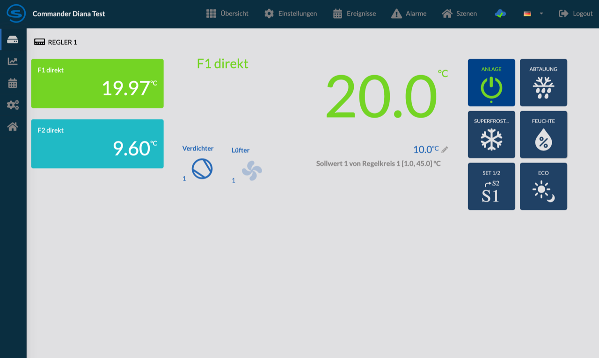

## Issues

### Bad contrast

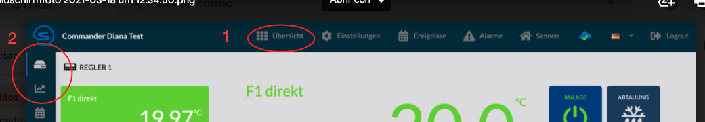

1. Both the text and the icons use a gray color, and they have a quite dark blue, which gives a lower contrast than recommended, I would suggest you use white instead of gray to give the best possible contrast and be much more legible.

2. Perhaps the previous point is due to the fact that they want to highlight the selected one. the marker to the left of the icon is fine, but they could use color inversion or use another color so they don't have to resort to using different shades of gray.

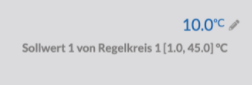

3. Very similar to 1, the contrast between the background and the text is not the most adequate.

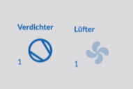

4. The fan icon is lighter than the compressor, is this because it is disabled? otherwise it should have the same opacity (solid)

### Colors

5. I identify the followings colors:

* blue:  `#0a2e40`
,  `#2369b1`,  `#296bb7`,  `#154187`,  `#204165`,  `#3cbac5`
* green:  `#74d424`,  `#5dd80b`
* gray:  `#e0e0e2`,  `#7b7c7d`,  `#c8c8c8`,  `#9b999a`
* white:  `#fefefe`

**NOTE** All colors are presented in hexadecimal-rgb presentation.

I recommend that the fewest possible colors be used and the colors used represent an intention, which could represent hierarchy (such as title and subtitle) or condition (on, off, error).

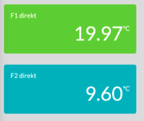

6. It is not very clear if the color represents a state such as: on and off, adequate and low temperature or enabled and disabled. respectively.

7. I recommend not using gray as the main background color as it has some issues with contrast as mentioned above. Also the screen may appear to be dirty or damaged.

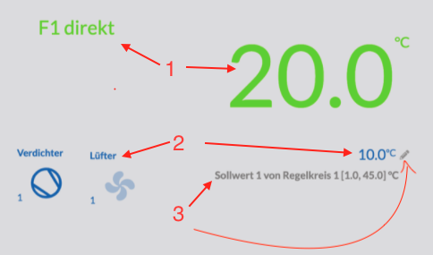

8. The intention is not very clear, is it by hierarchy or by state or by relationship?

      8.1. Do they have the same hierarchy, is it the same state or is it the temperature of F1?

      8.2. Do they have the same hierarchy, is it the same state or is it the temperature of compress and fan?

      8.3. Is it clarifying text like note, or is it disabled?

### Labeling

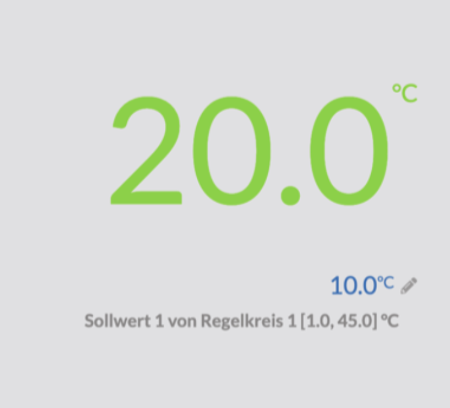

9. Putting a label on the two temperatures can let user know which is the meaning of those values.

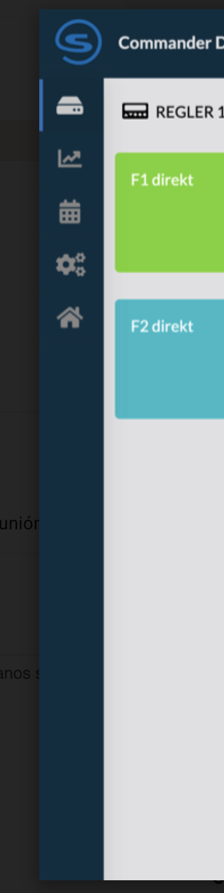

10. Sometimes it is not enough to just put the icons in sidebar, sometimes it is better also to put texts that indicate the functionality, just like the navbar. read more in [Do Icons Need Labels?](https://uxdesign.cc/do-icons-need-labels-6cb4f4282c00)

Example:

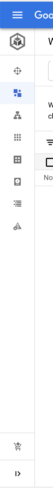
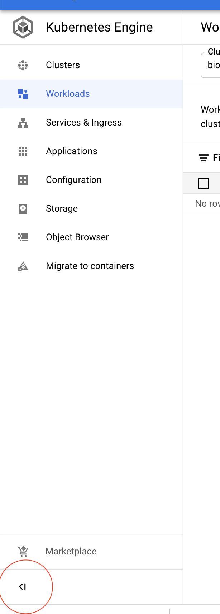

Here is an example to be flexible with the two versions, using a button in the footer of the sidebar

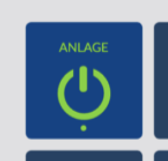

11. Usually the button has action's label below the icons, but I'm not sure if this is different in your country.

There some examples
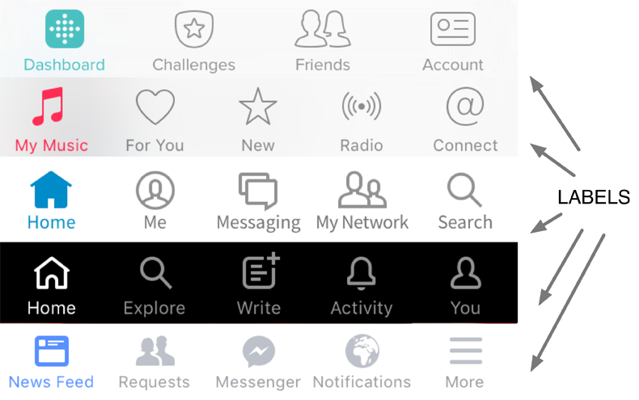

12. I am not sure about the icons used for the "compressor" and "eco", I am not very familiar with all the concepts and symbols of refrigeration, but at first look they are not very easy for me to guess.

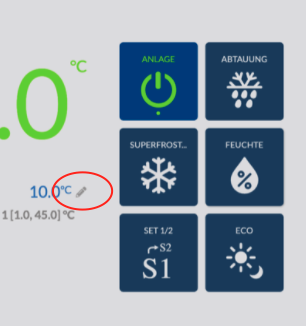

13. All action buttons look quite large, it seems that it refers to a touch screen, but the edit button does not seem to follow the same pattern.

14. For some reason the text "logout" is not in German

### Layout

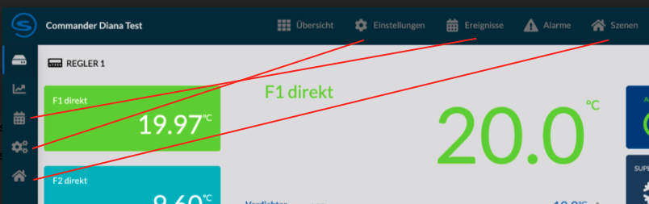

15. I don't understand why there are two navigation panels, I think one is enough.

16. Some navigation buttons seem to point to the same point.

17. The navigation button that represents home should be first.

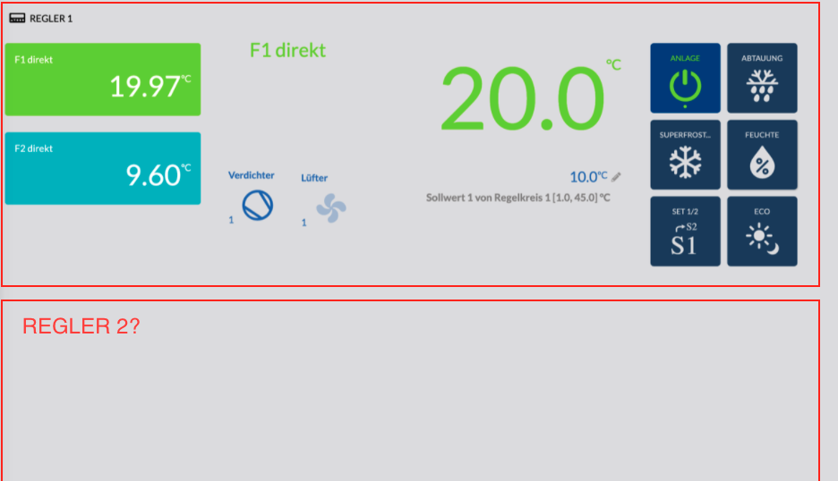

18. I have two feelings, 1. this can be a list, 2. it shows the main data of a single controller.

    18.1. Each item in the list should have a visual delimiter, usually it can be wrapped in a card.

    18.2. We could take advantage of the empty space below, to organize things better.

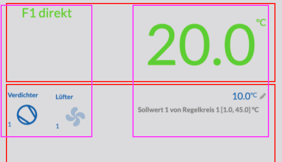

19. It is not very clear if the layout is in two columns (purple) or two rows (red).

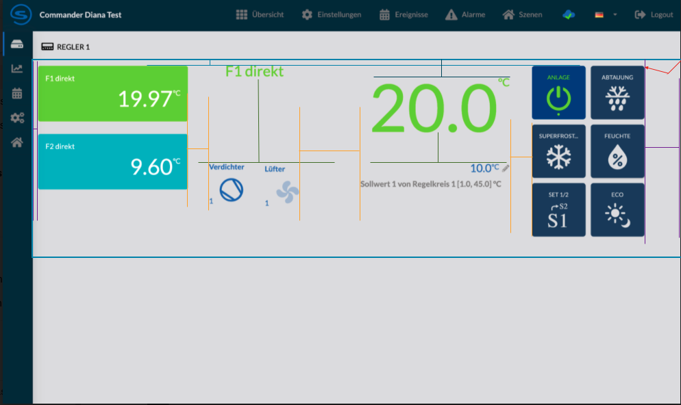

20. Many of the padding or margins have a bad composition among other elements, it is difficult to explain, so I have tried to put the paddings that should be similar but they are not with the same ones with the same colors

### UX (User eXperience)

**NOTE:** It is difficult to find issues by not being able to interact with the application, since we only have an image of the application

21. At this point of observation, I still do not understand the real intention of this screen, I think that this screen is to edit and display a controller to change the behavior of a refrigerator, but it really is not entirely clear to me.

    Is important to fix this feeling before focusing on topics with less impact.

22. According to the layout of the elements it does not seem that it was intended to be supported in mobile version, should we worry about it?

23. An UI is suggested to improve the user experience.

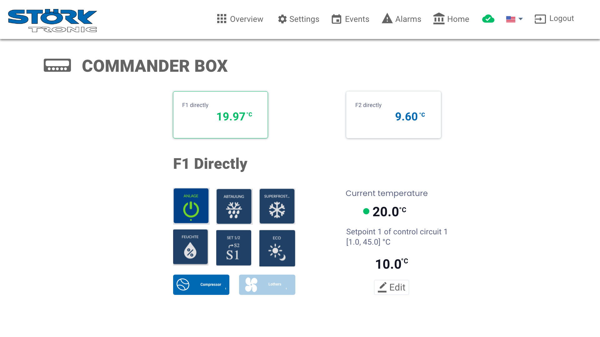
The source file can be found [here](adobe-xd/challenge-2-ux.xd)