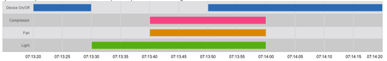

# Challenge 2 - Digital channels

## CommaderBox 001

The "CommanderBox 001" device stores the following events information:

1. When the device is turned on or off.
2. When the event light is turned on or off.
3. When the compressor is turned on or off.
4. When the fan turns on or off.

Question: Could you analyze this chart and let us know if you see any information that is wrong?

## Outcome

It appears that the device was turned off while the other components were turning on.

And later it stabilized again when the other components finished turning on.

It is unknown if the other components were shut down under a desired or undesired behavior.

### Speculation 1 (hardware/electronic)

Turning on some components of the controller may consume more energy when is turning on. this may impact the ability to send the status of the device. Because maybe the antenna to send information did not have enough electric fluid.

### Speculation 2 (software/CPU)

Turning on some components of the controller may consume more CPU for device when turned on. this can affect the ability to send device status. because the cpu does not have independent threads to send the information, or the start of the devices occupies enough CPU to generate a throttle and to send the information of the status.

