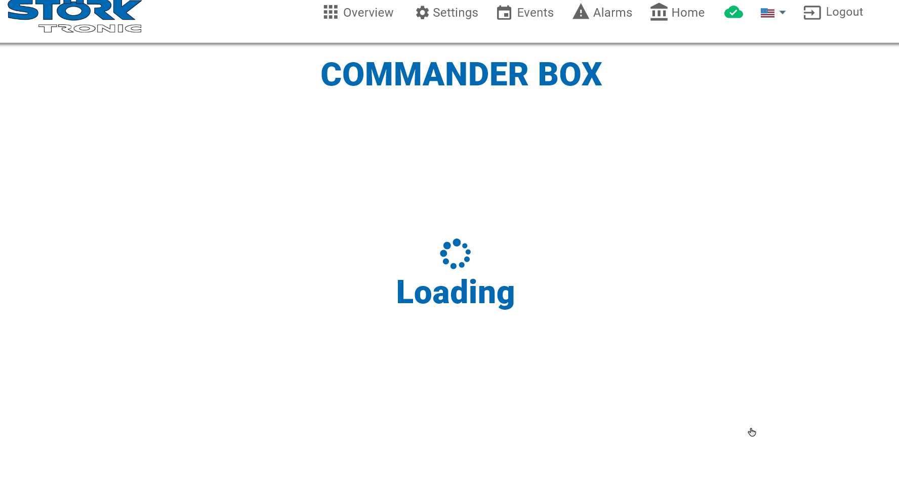

# Challenge 3 - Mock app

## CommaderBox 002

The "CommanderBox 002" collects and stores the events information "Turn On/Off", "Compressor", "Fan" and "light" every 10 seconds, the values might be:
On: The event is active
Off: The event is not active
INVALID: The state of the event is unknown because due to an error, the value of the event is invalid.

## Outcome

An interface is provided to visualize a single commander, you can also add more series to visualize more than one.

It has the following functionalities:

* shows events on a timeline chart
* different colors are shown for each component (customizable)
* Solid color, opaque color and gray are shown, for On, Invalid and Off respectively (customizable)
* zoom in / ot on the x-axis (time)
* select the area to zoom
* scroll on the x-axis (time)
* an overview of the components is shown at the bottom
* the zoom level is visible in the overview
* tools to alter the zoon in the overview
* Invalid data timeline in the overview, with the possibility of being clicked
* filters for status, components and date range to search
* tooltip in each bar to see additional information

The source file can be found [here](adobe-xd/challenge-3-commander-events.xd)